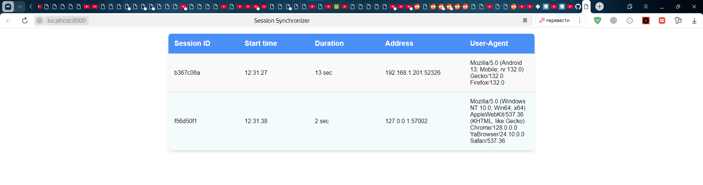
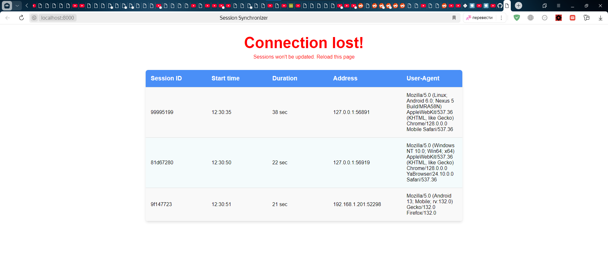
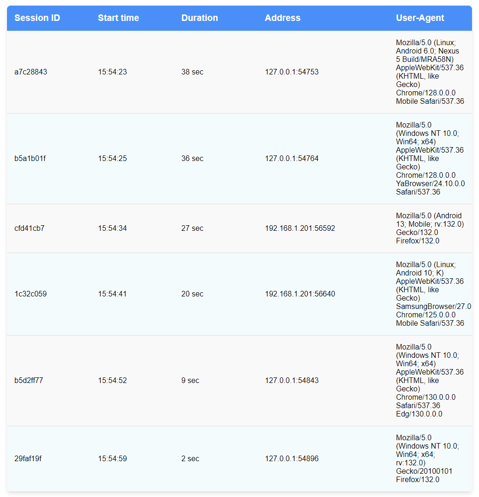
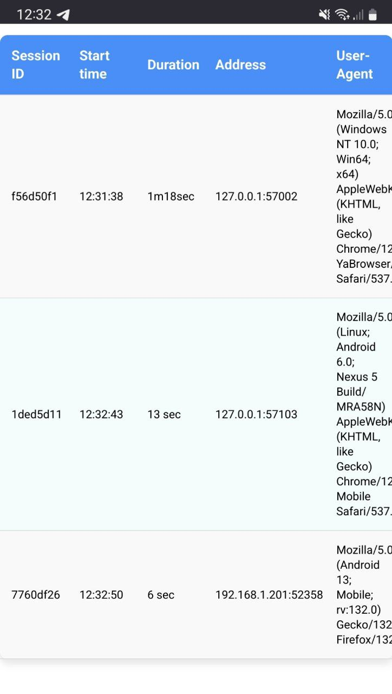
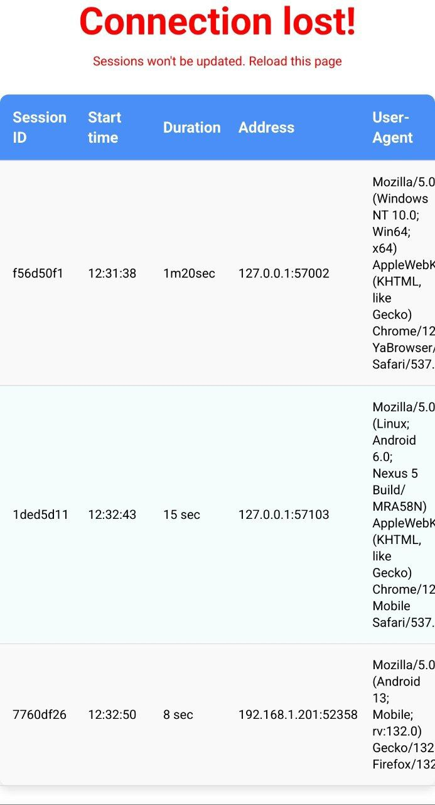
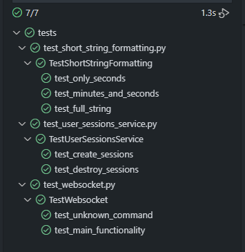

# Тестовое задание "Сихронизация клиентов"

> [!NOTE]
> Ниже приведено описание основных модулей приложения и скриншоты на разных устройствах

### Описание

Данное FastAPI приложение сохраняет информацию о подключённых клиентах через WebSocket и выдаёт всем клиентам информацию о текущих подключениях.

### Структура

- `main.py` - точка входа. Там определены маршруты ("/" и "/ws" для вебсокетов), конфигурация логгера и внедрения зависимостей
- `servives.py` - модуль сервисов, содержащий в себе класс `UserSessionsService`, управляющий сессиями пользователей через хранилище `UserSessionsRepository`, интерфейс которого определён в том же модуле (`services.py`)
- `repositories.py` - модуль конкретных реализаций хранилищ (репозиториев), имплементирующих методы `UserSessionsRepository` из `services.py`
- `models.py` - содержит модель сессии пользователя `UserSession`, которой - оперируют сервис и хранилище
- `dto.py` - содержит pydantic модель представления данных для клиентов приложения `UserSessionDTO`. В эту модель преобразуется модель `UserSession`
- `mappers.py` - содержит функцию `map_user_sessions_to_dtos`, преобразующую модели `UserSession` в `UserSessionDTO`
- `helpers.py` - содержит вспомогательную функицю `format_timedelta_to_short_string`, преобразующую `datetime.timedelta` в короткое строковое представление времени (5 sec, 1m28sec, 1h2m11s)
- `./static/` - хранит в себе стили и JavaScript код клиента
- `./templates/` - содержит файл `index.html`, который отдаётся клиенту при обращении на корневой эндпоинт "/"
- `./tests/` - содержит юнит и интеграционные тесты. Есть тесты на генерацию короткого представления времени (функции `format_timedelta_to_short_string`), тесты сервиса и интеграционный тест функционала вебсокет подключения к приложению
- `./.vscode/` - конфиг для VSCode для запуска тестов через графический интерфейс

### Скриншоты

#### Десктопный браузер

#### Мобильный браузер (Firefox, Android, Samsung)

#### Тесты

